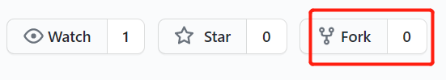

# 开始之前

在动手开始编辑之前，请确保：

- 您有一个 GitHub 帐户。您可以在 [这里注册](https://github.com/join)

完成注册之后，您也许会觉得 GitHub 的页面看起来十分复杂费解。不要被吓到，如果只是想为本站添砖加瓦，并不需要搞清楚那些复杂的功能都是做什么用的。只需要照下面的教程一步步来就可以了，其实编辑本站文章所需要的那点功能，也并不比在其它网站上写东西更难用。所有搞不懂的功能，一概不看就好了。当然如果您有兴趣的话，GitHub 还是值得学习的一个强大工具，但那就超出本文的范围了。

编辑本网站内容有两种办法。

1. [直接编辑](#如何直接编辑文章)。对于核心参与者来说，可以直接编辑每篇文章。但您需要先联系我们获得权限。
2. [在自己的仓库中编辑文章](#如何在自己的仓库中编辑文章)。其它朋友可以先将本网站的内容复制一份到自己的 GitHub 帐号下，然后再做编辑。这样的话，您无需担心您的编辑会对我们的网站产生影响。待您编辑好之后，可以发 Pull Request 给我们，以便我们把您的编辑合并到网站中。

无论采用哪种方法，如果您没有看到您的编辑效果立刻反映在网站上，请不要着急，这是正常的。我们每隔一段时间会更新一次网站，下次更新之后，就可以看到您的贡献了。

# 如何直接编辑文章

如果您已经[联系](../#如果您愿意长期参与讨论)过我们，并且我们已经给了您直接编辑本站文章的权限，那么您可以直接在浏览器中编辑文章。

在本站每一篇文章（包括这篇）的右上角，都有一个“Edit this page”的链接，点击这个链接，就可以跳转到相应的 GitHub 页面，然后点击垃圾桶图标左边的笔状图标即可修改文章。

点击按钮之后您会看到一个 markdown 文档。

关于编辑文章的注意事项，如果您有兴趣可以参考这份 [说明](../write)。

完成编辑之后，滚到页面最下面，填入您本次编辑的简单说明，然后按绿色的 Commit Changes 按钮，即完成了编辑。

# 如何在自己的仓库中编辑文章

如我们在一开始所讲的，如果您怕直接编辑会搞乱网站的话，可以复制一份到您自己的帐号下随意编辑，编辑完成之后再请我们合并您的贡献。

这只需要简单的三步：复制我们的仓库，编辑文章，请我们合并您的更改。

首先，您需要创造我们站点的一个 fork。
所谓 fork，就是我们网站的一个复本。官方翻译叫作“复刻”。GitHub 官方对此有详尽的 [文档](https://docs.github.com/cn/github/collaborating-with-issues-and-pull-requests/working-with-forks)，但中文文档未免有些晦涩，因此我们在这里写一个简单的教程。

## 创建 fork （复刻）

首先访问[本站的 GitHub 仓库](https://github.com/xuan-w/fuzhutech)，然后点击页面右上角的 fork 按钮。

点击之后按提示确认即可。

## 编辑文章

类似于 [直接编辑](#如何直接编辑文章)，您可以从我们网站每篇文章右上角的“Edit this page”按钮开始。
只是点开之后您无法直接编辑，接下来的事情稍有些不同。您需要把我们的帐户名称替换为您自己的帐户名称。

这很简单，比如说您直接点击浏览器中“Edit this page”得到如下示例链接

`https://github.com/fuzhujishu/fuzhutech/blob/main/content/contribute/github/_index.md`

点击浏览器的地址栏，编辑一下这个链接，将链接中的 fuzhujishu 替换为您自己的 GitHub 用户名就可以了。假如您自己的用户名为 username，编辑之后的链接就成了下面这样。

`https://github.com/username/fuzhutech/blob/main/content/contribute/github/_index.md`

特别需要注意的是，如果您不是第一次编辑文章，在您开始编辑之前，请确定您已经更新您的仓库到最新版本。具体请见 [如何重新 fork](#如何重新-fork)。

接下来步骤，和 [直接编辑](#如何直接编辑文章) 一样，点击笔状图标进行编辑，最后按绿色 Commit Changes 按钮完成编辑。

关于编辑文章的注意事项，如果您有兴趣可以参考这份 [说明](../write)。

## 发 Pull Request

编辑完成之后，下一步是给我们发 Pull Request 以便我们可以审核您的编辑，并修正一些可能影响网站的问题。

在您仓库的主页，点击右上角的 Pull Request 按钮，按提示确认，即可发送 Pull Reqest。我们收到之后会及时将您的编辑合并到我们的文章中。

## 如何重新 fork

如果您以前 fork 过我们的网站，但中间我们的网站又更新了，您在重新编辑之前，需要保持和我们的仓库同步。很遗憾的是，这个操作略有点麻烦。

有两种办法实现这个目标。第一个办法是删除仓库，重新 fork。第二种办法是 pull 我们的最新更改。后者也许改日可以发一个教程。现在我们先讲第一个办法。

1. 您首先需要备份好您原来仓库里的所有东西。
2. 在您仓库首页点右上角齿轮 Setting 按钮
3. 一路滚到页面最底下，点击“Delete this repository”
4. 重新[创建 fork](#创建-fork-复刻)
